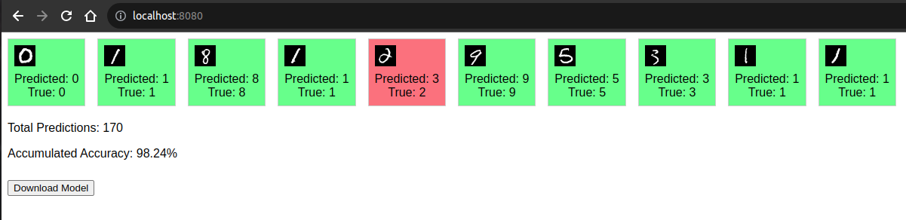

# MNIST Classifier Project

## Introduction

This project serves as a demonstration to Machine Learning Engineers on how to leverage Docker for deploying machine learning models, especially when working with remote servers. Through a simple yet complete example, this project encapsulates a workflow that includes a Flask backend for serving predictions, a frontend for user interactions, and a Redis database for state management, all containerized using Docker.



## Project Structure

The project is organized into three main components, each running in its own Docker container:

1. **Flask/ML Backend**: Handles incoming requests, serves model predictions, and manages model state.
2. **Frontend**: Provides a user interface for interacting with the model, displaying predictions, and downloading the model.
3. **Redis Database**: Keeps track of the model's state and overall prediction statistics.

## Endpoints

- `/`: The dashboard displays the recent predictions made by the model. Each prediction is shown alongside the corresponding image from the MNIST test set. Correct predictions are highlighted with a green background, while incorrect predictions are highlighted with a red background.
- `/get_predictions`: Returns a JSON object containing data related to 10 images randomly picked from the MNIST test set, along with their predicted and actual labels.
- `/download_model`: Allows users to download the trained model file.

## Getting Started

### Prerequisites

- Docker and Docker Compose installed on your machine.
- Basic knowledge of Docker, Flask, and Redis.

### Running the Project

1. Clone the repository to your local machine.
```bash
git clone https://github.com/Ardeshir-Shon/generalMeetingDockerIntro.git
```
2. Navigate to the project directory.
```bash
cd generalMeetingDockerIntro
```
3. Build and run the Docker containers using Docker Compose.
```bash
docker-compose up --build
```
4. Access the application by navigating to http://localhost:8080 in your web browser.

## Interacting with the Application

Once the application is running:

The dashboard at the root URL (/) will display the most recent predictions.
Click the "Download Model" button to download the trained model file.
The /get_predictions endpoint can be used to manually fetch prediction data in JSON format (mostly for debugging or other backend purposes).

### License
This project is licensed under the MIT License - see the LICENSE.md file for details.


